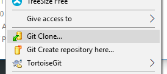
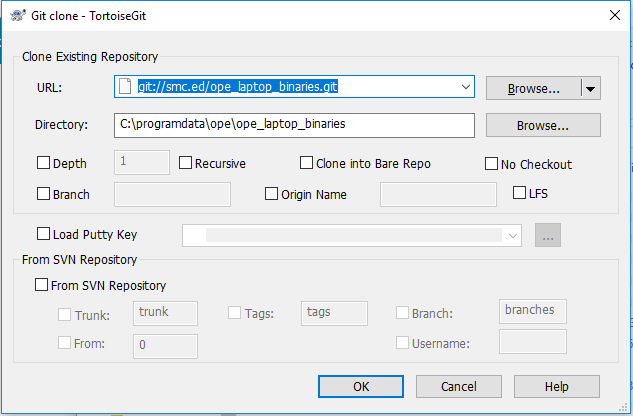

# LMS App - Common Issues

## Not Credentialed Error
For the LMS app to work, you need to run the laptop credential tool which applies security, installs the latest LMS app, and sets up the Canvas credentials for the student.
### Credential Steps
1. Login as the admin user
2. Open c:\programdata\ope folder (create if needed)
3. Clone or update the git folder
    * To clone - right click and choose clone:
        - 
        - Clone from SMC: ` git://smc.ed/ope_laptop_binaries.git `
 
    * To update - you can right click on the ope_laptop_binaries folder and choose Git -> Pull. Running the CredentialLaptop.cmd file should also do this as a first step.
4. Run "CredentialLaptop.cmd".  This will install needed apps, setup security, and do the credential process.
5. Final Steps:
    1. Set windows admin password
    2. Set BIOS admin password
    3. Disable alternate boot options in BIOS (only boot form hard drive) and disable the SD card port.

## Courses not showing up after sync
- Make sure the student is enrolled in Canvas
- Make sure the course is published - any courses, modules, etc... that aren't published won't be visible to the student in the LMS app
- Make sure the student has "Accepted" the enrollment in canvas - When adding a student to a course from canvas (not via the SMC) the student needs to login to the desktop and "Accept" the course before it shows up in their dashboard. Only courses in their dashboard will show up in the LMS app

## Why aren't assignments/modules showing up?
- Dates set? - If you set a date for an item, it will NOT show up in the LMS App until that date arrives. Make sure to remove dates or adjust them so that they are open prior to syncing.
 

## Corrupted Downloads
- If you are getting corrupted downloads, especially video files, check that your sync box is up to date. The original sync boxes had a cloned MAC address on their network port which meant that multiple sync boxes were using the same MAC address. Weird things happen when you have duplicate MAC addresses. Run the update from the SyncApp - it is under the utilities button. Ask for the proper password for the sync box.

## Known Bugs
- Assignments - File uploads work, others do not yet
- Very Fast Sync? - If the sync is done in less then 15 seconds, it likely didn't work. Close the LMS app and try again.

