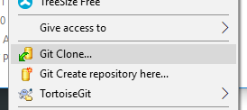
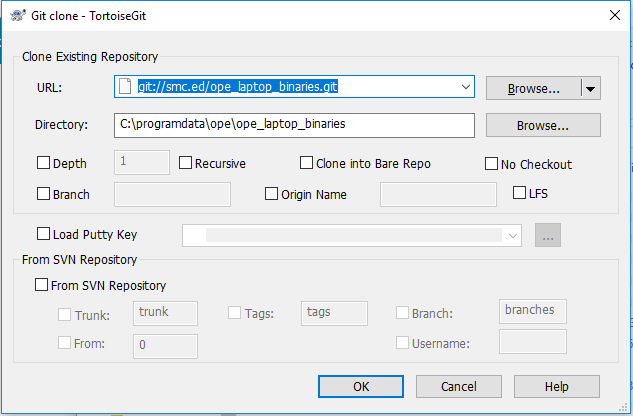

# LMS App - Common Issues

## Not Credentialed Error
For the LMS app to work, you need to run the laptop credential tool which applies security, installs the latest LMS app, and sets up the Canvas credentials for the student.
### Credential Steps
1. Login as the admin user
2. Open c:\programdata\ope folder (create if needed)
3. Clone or update the git folder
    * To clone - right click and choose clone:
        - 
        - Clone from SMC: ` git://smc.ed/ope_laptop_binaries.git `
 
    * To update - you can right click on the ope_laptop_binaries folder and choose Git -> Pull. Running the CredentialLaptop.cmd file should also do this as a first step.
4. Run "CredentialLaptop.cmd".  This will install needed apps, setup security, and do the credential process.
5. Final Steps:
    1. Set windows admin password
    2. Set BIOS admin password
    3. Disable alternate boot options in BIOS (only boot form hard drive) and disable the SD card port.

## Courses not showing up after sync
- Make sure the student is enrolled in Canvas
- Make sure the course is published - any courses, modules, etc... that aren't published won't be visible to the student in the LMS app

## Known Bugs
- Assignments are flaky - not all sync, no good messages yet to warn why
