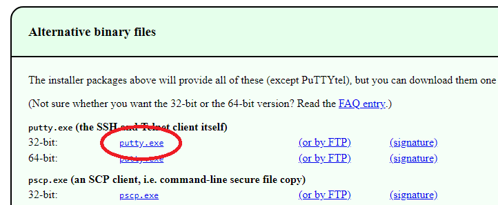

# Troubleshooting Server Issues

## Apps won't start?
Sometimes docker will get stuck. First thing to try is use the Utility button on the Sync App and tell it to restart the apps. If that doesn't work, you can try some manual things.

### Logging in with Putty
#### Download Putty
Get the binary - no need to get full MSI installer.

[Download Putty] (https://www.chiark.greenend.org.uk/~sgtatham/putty/latest.html)

#### Login
It works best to login with the IP of the OPE server. If things are down, the domain name may not resolve. Login with "root" as the username and your password.

### Restart Docker Service
Try `docker ps` to see if things are running. If you get an error, you may need to restart the docker service.

Stop the service
`service docker stop`

Might need to remove the .sock file
`rm -Rf /var/run/docker.sock`

Start the service
`service docker start`

Give it a few seconds, then you should see your apps running
`docker ps`

### Restart OPE apps
You can do a full restart of the docker apps (smc, canvas, etc...)
1. `cd /ope/docker_build_files`  (assuming your stuff is stored in the /ope folder)
2. `docker-compose down`  (if you see an error, just run it again, sometimes it gets stuck. If it keeps showing an error, restart the docker service)
3. `./up ` (makes the configs rebuild and launch)
4. Most things should be up within 30 seconds. Canvas generally takes anywhere from 3-15 minutes to start.

### Cleanup old Docker images
As you do updates, old app images are left in the system. If you notice lots of space being used that isn't located in the /ope/volumes folder, it may be old docker images.

Warning: This may take several minutes and put a load on the server - services may be slow during cleanup

- Cleaup app that are stopped: `docker rm -v $(docker ps -a -q -f status=exited)`
- Cleanup old images that aren't referenced anymore: `docker rmi $(docker images -q -f dangling=true)`
